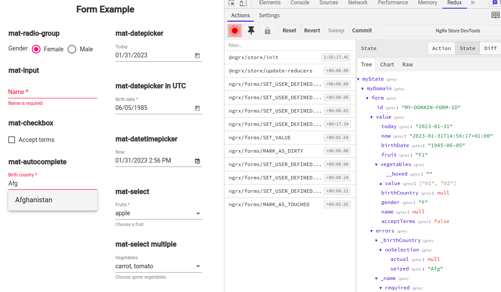

# Ngrx Forms Material

This project enhances compatibility between [Angular Material](https://github.com/angular/components) elements and the [Ngrx Forms](https://github.com/MrWolfZ/ngrx-forms) library.



## Installation

```bash
  npm i ngrx-forms-material
```

## Usage

- Import **NgrxFormsMaterialModule** in your app
- Put **"allowSyntheticDefaultImports": true** in your **tsconfig.json** for *moment.js* import
- Refer to the following section for features
- Refer to the demo app in the projects folder for implementation details.

## Features

The project aims to provide the following improvements:

- [mat-datepicker](https://material.angular.io/components/datepicker/overview):
  - Compatibility for elements with selector: ```input[ngrxFormControlState][matDatepicker]```
  - Minimum and maximum date management with **min** and **max** inputs
  - ISO8601 date conversion with **NgrxDateToISO8601** for use with **ngrxValueConverter** directive
  - ISO8601 UTC date conversion with **NgrxDateToISO8601UTC** for use with **ngrxValueConverter** directive

- [mat-select](https://material.angular.io/components/select/overview) :
  - Compatibility for elements with selector: ```mat-select[ngrxFormControlState]```
  - Support for *multiple* selectors

- [mat-autocomplete](https://material.angular.io/components/autocomplete/overview) :
  - Compatibility for elements with selector: ```input[ngrxFormControlState][matAutocomplete]```
  - Management of minimum characters for autocomplete activation with **autocompleteMinChars** input
  - **autocompleteValue** validator for use with **updateGroup** to validate the field
  - **requiredAutocompleteValue** validator for use with **updateGroup** to validate required fields
  - Autocomplete field conversion with **NgrxAutocompleteConverter** for use with **ngrxValueConverter** directive

- mat-error :
  - Compatibility for elements with selector: ```[ngrxFormControlState]```

Anyway, it gives to you some usefull store tools :

- **createNgrxFormAdapter** : Adapter for Ngrx Forms with form ID and initial data
- **getInitialFormState** : Retrieve initial form state
- **createInitialStateFactory** : Create the initial form state
- **createSelectorsFactory** : Create selectors to retrieve form information such as selectFormGroup, selectFormControls, selectFormGroupData, selectLastFocusedAutocompleteField, and selectLastFocusedAutocompleteData

## Licence

MIT
